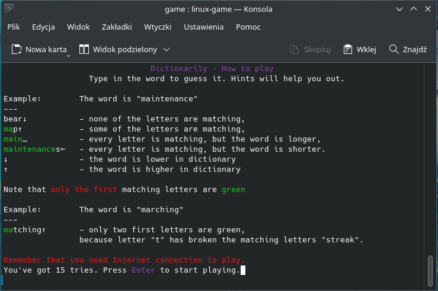
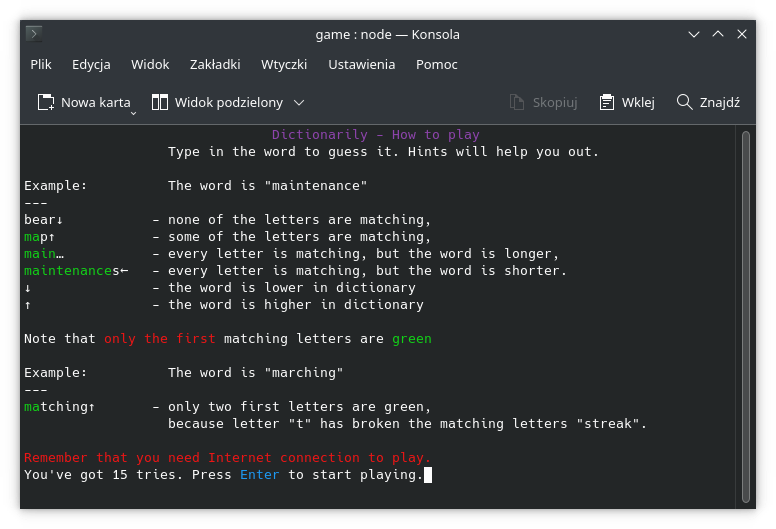

# Dictionarily
A simple word game made in Node.JS. Inspired by Słownikowo: https://literalnie.fun/slownikowo.

# How does it work?
When you start the game, it fetches a random word and tells you to guess it.
Each guess is verified if it's in the dictionary so you guess by typing real words and not random letters.
After that, game gives you hints about what you should type next (look below).

# Languages
English is the only language supported so far, but I plan on adding Polish and German in the future.

# Requirements
- A computer with Linux, Windows, or macOS operating system,
- Node.JS v18.13.0 or newer (may work on older versions, but not guaranteed),
- Terminal window sized 88x22 or more (columns x rows) or command line session,
- Wide vocabulary knowledge ;)

*app may be unstable on macOS*

# How to run?
Make sure to meet all the system requirements. Then open your OS's terminal window and run the game:
- Linux: `node game.js` or `./linux-game`
- Windows: `node game.js`
- macOS: `node game.js`

# Cheats
- More guesses - edit line 23 and 216 and put in as many chances as you want.
- Disable word verifying - comment out lines 121 and 123-126.

# About online game version
The regular game version doesn't use the Internet, but the JSON file with downloaded Heroku word database.
However, there is an experimental version of the game using following web API-s to fetch & verify words.
- https://random-word-api.vercel.app/api?words=1 - word fetching API
- https://api.dictionaryapi.dev/api/v2/entries/en/word - word verifying API\
The only special requirement to run the online version is the Internet connection.\
When do you want to use an online version of a game?
- When every kilobyte of disk space is valuable,
- When you have to be sure that everything is alright with the word database (offline JSON can be edited by an accident or by someone else),
- When you like to betatest things.\
How to run the online game version?\
Make sure to meet all the system requirements. Then open your OS's terminal window and change the directory to `online-experimental`, then run the game:
- Linux: `node game-online.js` or `./linux-game-online`
- Windows: `node game-online.js`
- macOS: `node game-online.js`\
Cheats for the online game version are a little different:
- More guesses - edit line 21 and 268 and put in as many chances as you want.
- Disable word verifying - comment out lines 158 and 160-177.\

Screenshot of the online game version below:

